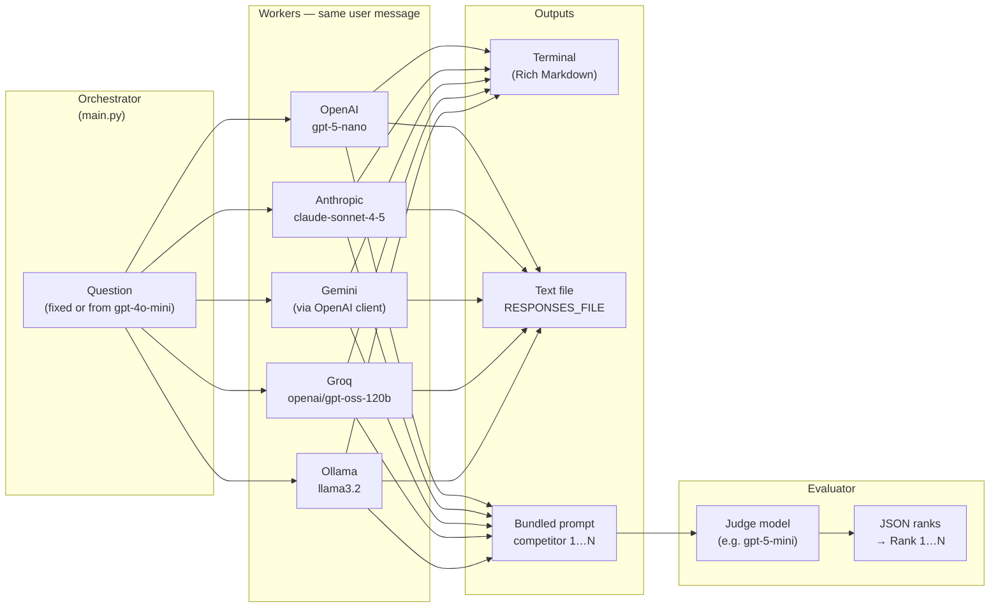

# Multi-model orchestration

A small Python script that runs the **same prompt** through several LLM providers, saves every answer to a text file, then uses a **separate judge model** to rank competitors by clarity and strength of argument. Output is printed in the terminal with Markdown rendering ([Rich](https://github.com/Textualize/rich)).

## What the code does

1. **Question** — Either a fixed string in `main.py` or a question drafted by `gpt-4o-mini` from a seed prompt.
2. **Competitors** — The same `messages` are sent to each model in turn (OpenAI, Anthropic Claude, Gemini via OpenAI-compatible API, Groq, local Ollama). Each reply is shown with a model header and appended to lists.
3. **Persistence** — All pairs `(model_name, response)` are written to `multimodel_orchestration_responses2.txt` (path set in `RESPONSES_FILE`).
4. **Judge** — Answers are labeled “competitor 1 … N” and embedded in a judge prompt. A final model (`gpt-5-mini` in code) must return **only JSON** like `{"results": ["3", "1", …]}` with competitor indices; the script maps those back to model names and prints ranks.

See `main.py` for the exact models and prompts.

## Setup

- **Python** 3.14+ (see `pyproject.toml`).
- **Install** (with [uv](https://github.com/astral-sh/uv)):

  ```bash
  uv sync
  ```

- **Environment** — Create a `.env` in the project root. Keys used by the current script include:

  | Variable | Purpose |
  |----------|---------|
  | `OPENAI_API_KEY` | OpenAI models + judge + Gemini-style calls that use OpenAI client |
  | `ANTHROPIC_API_KEY` | Claude (`claude.messages.create`) |
  | `GEMINI_API_KEY` | Gemini base URL in code |
  | `GROQ_API_KEY` | Groq OpenAI-compatible API |
  | `DEEPSEEK_API_KEY` | Optional; DeepSeek block is commented out |

  Ollama is assumed at `http://localhost:11434/v1` with a placeholder API key string.

- **Run**:

  ```bash
  uv run main.py
  ```

## Anthropic-style agent / workflow pattern (analysis)

Anthropic’s [Building effective agents](https://www.anthropic.com/engineering/building-effective-agents) material describes **workflows** as predictable pipelines of LLM steps (as opposed to fully autonomous agents). This project matches several of those ideas, even though it is a single script rather than a full agent framework.

| Pattern | How this repo maps to it |
|--------|---------------------------|
| **Orchestrator–workers** | `main.py` is the **orchestrator**: it owns the task definition, calls each **worker** (each competitor model) with the same user message, and collects outputs. Workers are interchangeable answer generators. |
| **Parallelization** | The *idea* is “many models answer in parallel”; the *implementation* is **sequential** API calls. You could refactor to `asyncio` or threads for true parallelism. |
| **Evaluator** (related to **evaluator–optimizer**) | A dedicated **judge** LLM reads all responses and returns a **structured ranking** (JSON). Anthropic’s full **evaluator–optimizer** loop would feed critiques back into another generation step; here there is **evaluation only** (rank once), no rewrite loop. |

Claude is used as **one worker** among several: `Anthropic().messages.create(...)`, which is the **Messages API** (not the same shape as OpenAI’s `chat.completions`). The comment in code that `max_tokens` is required reflects Anthropic’s API contract for `messages.create`.

### Diagram (orchestrator → workers → evaluator)



### Why this is not a full “Anthropic agent”

- There is **no tool use**, **no multi-turn agent loop**, and **no memory** beyond the current run.
- The **evaluator** does not drive another generation pass; it only **ranks**.

Treating the script as an **orchestrator + parallel-style workers + LLM-as-judge** matches how Anthropic talks about **composable workflow patterns** for reliable LLM systems.

## Troubleshooting

- **`ImportError` for `load_dotenv`** — Use the **`python-dotenv`** package only; do not install the unrelated **`python-env`** package (it ships a conflicting `dotenv` module). See `dotenv-import-fix.txt`.
- **Judge `json.loads` fails** — The judge must return pure JSON. If the model wraps JSON in markdown fences, strip code fences before parsing or tighten the judge prompt.

## License

Add a license if you publish this repository.
